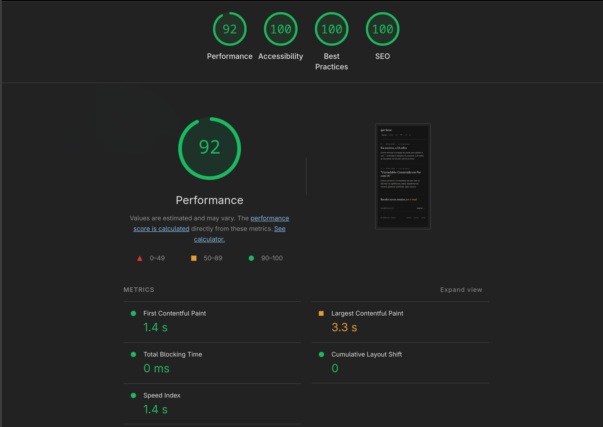

I built this blog with AI. Every component, every pipeline, every stack decision passed through the loop "I ask, it proposes, I critique, we iterate." And Lighthouse hits 100 on A11y, Best Practices, and SEO across mobile and desktop. Performance lands at 92 on mobile, 100 on desktop.

Some people will side-eye this. Vibe coding in production, on an experimental stack, deployed on Cloudflare Workers, written in pair with AI. Each one sounds risky on its own. Together, almost reckless.

But we have the result. That's exactly what this post is about.

---

## Why AI

I wanted to answer a concrete question. How far can AI go on a real production project, with real quality, measurable metrics, no hand-waving. Not a toy example. Not a landing page with Lorem Ipsum. A real site, with real SEO, working RSS, dynamic OG images, automated deploy, tests that fail when something breaks.

Rule I followed: don't accept anything I don't understand. If AI proposed a solution I couldn't defend in a code review, scrap it. If I couldn't explain to myself WHY a line was there, out it goes.

---

## Choosing vinext

Vinext is Vite 8 + React 19 SSR that reimplements the Next.js API. Version 0.0.43 when we started. Basically alpha at zero dot zero something.

It wasn't meant to be comfortable. It was meant to be a showcase.

The thesis: if AI can build a SERIOUS project on a stack it barely saw in training (vinext barely shows up in canonical docs), then the argument "AI just replicates patterns it has seen" falls. Not all the way, but a lot.

Spoiler: I read more GitHub issues than prompts.

---

## How the Collaboration Went

Each important decision came out of a conversational loop. Two moments that stuck with me.

**The Shiki bug.** Tried shiki with the default engine (oniguruma WASM). Crashed in production with Cloudflare error 1101. AI on its own would keep circling the error without reaching the cause. I dug into the Cloudflare docs and found the architectural restriction: `WebAssembly.instantiate()` from bytes is blocked in Workers. Came back to it with that in hand. Then it proposed `createJavaScriptRegexEngine`, plus the bundle refactor to import only the languages we actually use in posts (`css`, `tsx`, `typescript`, `yaml`) instead of shiki's full bundle. Worked first try. Slimmer Worker, faster build. Total iteration: 15 minutes.

**The skills pipeline.** I documented this in detail in [I Write, AI Edits](/en/posts/eu-escrevo-ia-edita). At some point I decided I wanted to write in my own voice without AI writing for me. We built two skills: `personal-voice` (converts a raw draft into my voice) and `editorial-template` (structures polished prose into a publishable bundle). The first has `voice-profile.md` with verbatim citations from my corpus. The second has `dan-patterns.md` based on overreacted.io. Each skill, ONE responsibility. AI uses these skills every time I write now, and the result stays auditable. I compare the raw draft with the output and see exactly what changed.

---

## The Full Stack

Here's what's actually running:

- vinext 0.0.43 — Vite 8 + React 19 SSR with Next.js-compat API
- App Router with `[locale]` dynamic segment
- Tailwind v4 with tokens in `styles/tokens.css`
- marked + shiki for markdown (JS engine, not WASM)
- `next/og` for dynamic OG images
- oxlint + oxfmt (Rust-based, ~50× faster than ESLint/Prettier)
- vitest unit + smoke
- husky + lint-staged pre-commit/pre-push
- GitHub Actions CI
- Cloudflare Workers deploy
- Yarn 4 (Berry) with Corepack

Practically everything state-of-the-art. And practically everything recent. vinext at 0.0.43, Vite 8 (just released), Tailwind v4 (alpha not long ago), oxlint/oxfmt (Rust tooling that's emerging).

---

## CI / CD / Tests

Three gates between editing and serving.

**Local (husky):**

- pre-commit: `oxlint --fix` + `oxfmt` on staged files
- pre-push: `yarn check` (lint + format + typecheck + tests)

**CI (`.github/workflows/ci.yml`):**

- check: lint, format, typecheck, test --coverage, build
- smoke: builds, starts `vinext start`, runs HTTP tests on all routes
- vuln: `yarn npm audit --severity high`

**Deploy (`.github/workflows/deploy.yml`):**

- Runs only on push to `main`
- `npx vinext deploy` → `vite build` + `wrangler deploy`
- Production environment requires an approval click before running

Every PR runs the 3 parallel jobs. main has branch protection requiring all green before merge. Dependabot opens a weekly grouped PR for npm updates and a monthly one for GitHub Actions.

Bottom line: nothing reaches production without passing through automation.

---

## The Metrics

| Metric         | Home M | Home D | Post M | Post D |
| -------------- | ------ | ------ | ------ | ------ |
| Performance    | 92     | 100    | 92     | 100    |
| Accessibility  | 100    | 100    | 100    | 100    |
| Best Practices | 100    | 100    | 100    | 100    |
| SEO            | 100    | 100    | 100    | 100    |
| LCP            | 1.7s   | 0.1s   | 1.8s   | 0.5s   |
| CLS            | 0.001  | 0      | 0.017  | 0      |
| TBT            | 0ms    | 0ms    | 0ms    | 0ms    |
| FCP            | 1.7s   | 0.1s   | 1.8s   | 0.3s   |

Mobile has 1 point of measurement margin. Fine.

How each metric got to those numbers:

- **Performance.** Self-hosted fonts (JetBrains Mono, Newsreader, Geist), inline critical CSS in SSR, vinext bundle minified per environment. CLS started high from font-swap FOUT. Fixed with `font-display: swap` + fallback metrics. LCP started at 3.5s. Fixed by self-hosting JetBrains Mono inline in the layout's `CRITICAL_CSS`.
- **A11y.** WCAG AA color contrast via tokens, semantic HTML, aria labels where needed.
- **SEO.** Generated `sitemap.xml` dynamically via `app/sitemap.ts`, `robots.txt` via `app/robots.ts`, hreflang + canonical in every route's metadata, structured data (`BlogPosting` JSON-LD), dynamic OG images via `next/og`.

---

## Vinext Gotchas

Experimental stack charges a price. The main ones we tripped on:

- `next/font/google` is a runtime CDN load. Doesn't self-host like the real Next.js does. For a font that needs to be inline in critical CSS, you have to self-host manually.
- `next/og` only works in prod. Satori native modules crash Vite's RSC dev. You have to `vinext build && vinext start` to test OG images.
- `WebAssembly.instantiate()` from bytes is blocked in Workers. Default shiki crashes with error 1101. Solution: `createJavaScriptRegexEngine`.
- Vite does NOT minify SSR/Worker bundles by default. You have to set `build.minify: "esbuild"` per environment. Without it, ~40% more JS in the Worker.
- Use `vinext deploy`, NOT raw `wrangler deploy`. Without `vinext deploy`, the cloudflare-vite-plugin won't wire up the Worker's `main`. Result: assets-only deploy that 404s on dynamic routes.
- `opengraph-image.tsx` isn't auto-linked into metadata. Unlike Next.js, vinext doesn't auto-inject. You have to set `openGraph.images` explicitly in each `generateMetadata`.
- Ambient `next` types aren't automatically resolvable. vinext doesn't install `next`, so some type imports from the `"next"` module need declarations in `next-env.d.ts`.

Each gotcha cost between 30 minutes and 2 hours to resolve. Most aren't in vinext's docs. I had to read GitHub issues, the lib's own code, sometimes only figured it out by testing.

---

## Open Source

Repo at [github.com/igorhasse/unreadable](https://github.com/igorhasse/unreadable) under MIT.

Fork it, change `lib/site-config.ts` to your identity, run your own blog on the same stack.

But consider the caveats. vinext is 0.0.43. It can break between versions. Documentation is still thin. The community actively using it is small. There are features that looked like they worked and didn't (`next/og` in dev, `og:image` in meta), there are architectural decisions that still change (Next.js 16 renamed `middleware` to `proxy`, vinext followed).

If you need production TODAY, with SLA, with a big team, with proven stability, go straight Next.js. If you want to experiment with edge runtime + Vite + React 19 SSR on a personal project or MVP, vinext is a defensible choice. Just go in eyes open. AI helped me navigate that immaturity. Each gotcha became documented knowledge. Each solution was auditable. This post is part of that documentation.

As always.
